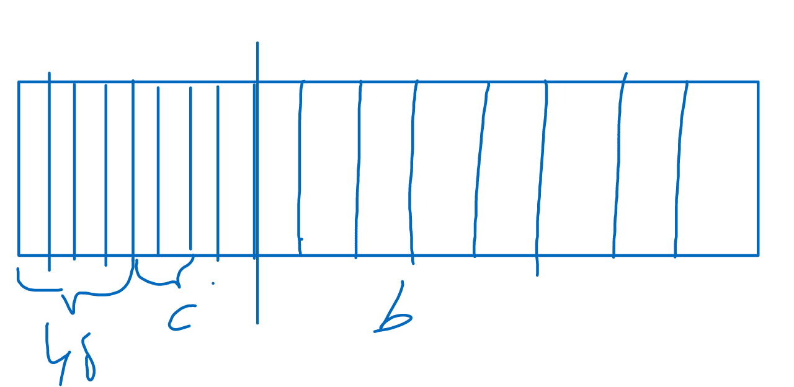
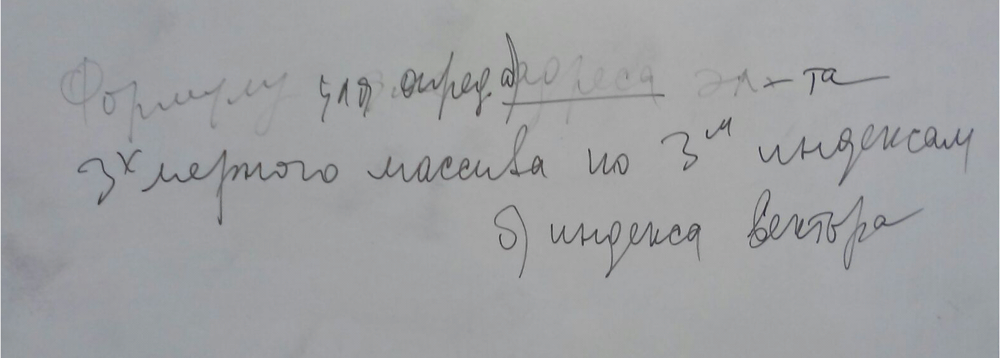

Структуры и алгоритмы обработки данных. Лекция 2
=============

<u>Указатели.</u> 
Программный уровень :
<ul><li>Переменные &lt;-&gt;Имя и значение</li></ul>
Машинный уровень :
<ul><li>Участок памяти &lt;-&gt;адрес памяти &lt;-&gt;содержание</li></ul>
<b>Указатель</b> -  переменная,  хранящую в себе адрес памяти.

 

Указатели в C++:
<ol><li>Указатель на объект. (содержит адрес области памяти  в которой хранятся данные определённого типа ) //тип*идентификатор</li><li>Указатель на void. (применяется в тех случаях,  когда не определён тип объекта,  адрес которого придётся хранить) //void*идентификатор</li></ol>

  Int *ptr1, *ptr2 ;
  ...
  Void *ptr=ptr1;
  Ptr2=(int *)ptr; //явное преобразование к типу int * (указатель на int)
  ..
  Double *fptr;
  Double *pointer =(double*) ptr;

   3. Указатель на функцию.

 
<u><b><i>Ссылки</i></b></u> 
Ссылка является синонимом имени. 

  Тип &  имя = инициализация ;
  Int kol;
  Int & pal=kol;
  Правила при работе  с ссылками

<ol><li>Ссылка явно инициализируется в описании</li><li>После инициализации ссылке не должна быть присвоена другая переменная</li><li>Тип ссылки должен совпадать с типом величины,  на которую ссылается.</li><li>Не разрешается определять указатели на ссылки,  массив ссылок и ссылки на ссылки</li></ol>
 <b>Основные статические структуры данных.</b> 
<ul><li>Структура</li></ul>
Объединяет элементы разных типов. Эти элементы называются полями и  могут быть определены любым типом,  кроме типа структуры,  но могут быть указателями на него.

 

  Struct Pr
  {
  Int a; //4 byte
  Double b; //8 byte
  Short c; //2 byte
  } Primer;

 
Поля хранятся последовательно. 
Выравнивание начальной части структуры является максимальным выравниванием любого отдельного поля. Каждое поле внутри структуры размещается в соответствие с своим выравниванием,  для чего может потребовать неявное внутреннее заполнение. Размер структуры должен быть целым числом,  кратным,  его выравниванию,  для этого может потребоваться дополнение после последнего поля. 
<ul><li>Объединение</li></ul>

  Union  Pr
  {
  Int a; //4 byte
  Double b; //8 byte
  Short c; //2 byte
  };
  ...
  Pr AB;
  В каждый момент времени вы можете работать с каждым значением хранения.
  AB.a=5;
  AB.b=37;//удалит значение 5
  AB.c=7;

<ul><li>Вектор</li></ul>
Размещается в одной сплошной области памяти.  Все его элементы имеют одинаковую длину и размещаются последовательно один за другим.  Доступ к элементам вектора осуществляется через  индекс. 
Для манипулирования данными,  хранимых вектором требуется управляющая информация,  определяющая адрес начала вектора,  длину или тип его элемента,  количество элементов,  индекс начального и конечного элемента.

Для хранения управляющей информации создаётся дескриптор( описатель)  вектора:
<ul><li>Адрес начала вектора a0=LOC(A[M]</li><li>Длина элемента</li><li>Индекс начального элемента M</li><li>Индекс конечного элемента N</li></ul>
Адрес элемента с индексом I 
LOC (A[I]) =LOC(A[M])+(I-M)*L 
При нумерации от 0 
LOC (A[I]) =LOC(A[0]) +(I-M)*L 

Все элементы хранятся в смежных участках памяти подряд. Два размещения массива в памяти:
<ul><li>По строкам (элементы в памяти располагаются строка за строкой,  при обращении массива чаще всего меняется последний индекс)</li><li>По столбцам (элементы располагаются в памяти последовательно столбец за столбцом, чаще всего меняется первый индекс)</li></ul>
 <u>Пример</u>. I, J, нумерация с нуля. 

  LOC(A[I][J]) =a0+a1*I+a2*J
  //a0,a1,a2 -  const.
  a0= LOC(A[0][0])//N1-максимадьный индекс по строкам
  a1= L*(N2+1) //количество столбцов
  a2 =L

 

Определение адреса элемента k-мерного массива 

  LOC(A[I1][J2].. [Ik] ) = LOC(A[0][0].. [0] )+ L*(n2+1)*(n3+1)*...*(nk+1)*I1+ L*(n2+1)*(n3+1)*...*(nk+1)*I2+ L*(n2+1)*(n3+1)*...*(nk+1)*Ik=LOC(A[0][0].. [0] )+summFrom1Tok ar*Ir.

