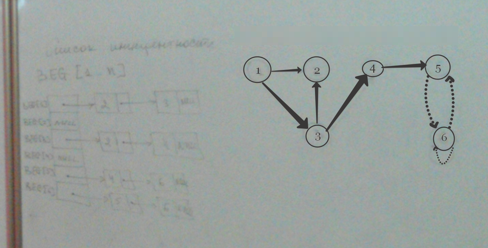
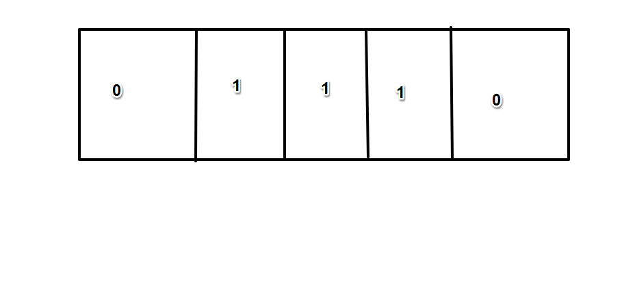

Графы.
==========
Список рёбер с 2xM
image1
исходные вершины: 1|1|3|5|5|6|6|
входящие вершины: 2|3|2|5|1|-|-|

Список инциндентности:
-------------------------
BEG[1..n]

для неориентированного графа:

*таблица:*

*пример:*
>*struct NODE
{
    int v;
    NODE *next;
    int weight;
};
...
const int u=...;
...
NODE* BEG[n];

Поразраядные  операции в C++
-------------------
    ~ поразрядное отрицание (унарная операция)
    & поразрядное И (бинарная)
    | поразрядная ИЛИ (бинарная)
    ^ поразрядное исключающее ИЛИ (бинарая)
*//***XOR***, сложение по модулю 2, mod 2 - остаток от деления*
При выполнении операциии операторы сопостовляются побитово.
image [таблица инстинности]

Операции сдвига:
-----------------
    .<< сбдвиг влево (бинарная)
    .>>сдвиг вправо (бинарная)
При сдвиге значение видов копируется в соседние разряды, крайние левые при сдвиге в право и крайние правые при сдвиге в лево сбрасываются.
Сдвиг влево/вправо используется для умножения целочисленного деления на 2 и выделения отдельных бит.
Побитовая операция И используется для проверки бита на 0 или 1 сброса разряда (установки их в 0) по маске.
Побитовая операция исключающая ИЛИ используется для инвертирования бит по маске
*Пример для unsing char x=0xB3;*
*Старший бит <- Младший бит*
*|0|1|0|0|0|0|1|1|*

    1. Получить младшие 4 бита.
    2. Получить старшие 4 бита (0100).
        x = (x&0x0F)|0x40;  
    3. Инверитировать старшие 4 бита
        x = x^0xF0;
    4. Проверка отдельных битов числа
        unsigned int x;
        ...
        for (int i = 0; i < 32; i++)
            if ((x<<31-i)>>31)...
            else...

