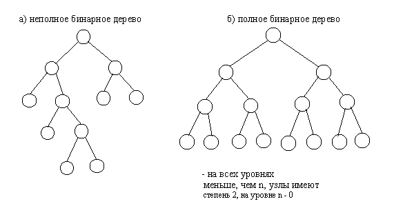

Теория графов
===========
Деревья
--------
**Дерево** - совокупность элементов, называемых узлами или вершинами, один них определён как корень и родительских отношений, образующих иерапхическую структуру узлов.
Узлы могут быть элементами любого типа.
*Рекурурентное определение*:
Дерево - конечное множество T одного и более узлов со след. свойствами:
    1. Существует один выделенный узел - **корень** данного дерева Т.
    2. Остальные узлы распределены среди m>=0 не пересекающихся множеств Т1...Tm и каждое множество в следующую очередь являются деревом и назывются **подеревьями** данного корня.

    3. Количество поддеревьев узла называются **степенью узла**.
    4. Узел со степенью 0 называется **концевым узлом** или **листом**.
    5. Все вершины, которые входят в ветви, исходящие из одной общей вершины назывются **потомками**(сыновьями), а сама вершина **предком**.
    6. *Высота* и *глубина* дерева определяется количеством уровней на котором располагается его вершины. Высота путого дерева - 0, высота дерева из одного корня - 1, уровень потомка на 1 превосходит уровеь его предка.
    7. Сыновья узла обычно упорядовачиваются слева на право, если порядок сыновей игнорируется, то такое дерево называется **неупорядоченное**. В противном случае дерево называется **упорядоченным**.

**Лес** - множество, обычно упорядоченное не содержащая ни одного не пересекающего дерева или содержащая несколько не пересекающихся деревьев.

Способы изображения
-------------
1. Иерархическая структура (с помощью графов)
2. Вложенные множества (диаграммы) 
3. Вложенные скобки (A(B(E)(F))(C(G))(D(H)(I(K)(L)(J))))
4. Список с отступами

   A
    B
     E
     F
    C
     G
     H
     I
      K
      L
     J

**Бинарное дерево** в котором каждая вершина имеет не более двух потомков, называемых левым и правым сыновьями. 

Деревья со степенью больше двух называются **сильно ветвящимися деревьями**.

Преобразование деревьев в бинарное дерево
-----------
:
    1. Для каждого узла дерева самый левый дочерний узел ставиться на уровень ниже прямо под узлом отцом, остальные дочерние узлы ставятся на этом же уровне правее первого узла
    2. Осуществляется поворот схемы на 45* по часовой стрелки так, что вертикальные становятся левыми, а горизонтальные правыми.

Преобразование леса в бинарные деревья
---------
   
   1. Каждый элемент леса обрабатывается по предыдущему алгоритму ^
   2. Корни деревьев леса соединяются горизонтальными линиями и осуществляется поворот по часовой стрелке на 45*.

Обход дерева
-------
**Обход дерева** - процедура, при которой каждый узел посещается один раз, а полных обход дерева создаёт линейное упорядочивание уго узлов.
Способы обхода
    1. Прямой обход
        - попасть в корнь;
        - пройти левое поддерево;
        - пройти правое поддерево.
    2. Центрированный (симметричный)
        - пройти левое поддерево;
        - попасть в корень;
        - пройти правое поддерево.
    3. Обратный обход (восходящий)
        - пройти левое поддерево;
        - пройти правое поддерево;
        - попасть в корень.

Представления дерева в ЭВМ
---------
СВязанное представление
>       struct Node
        {
         int el;
         Node *left, *right;   
        }

Прошитое дерево
В этом методе кольцевые связи заменяются нитями, которые связаны с другими частями дерева для упрощения его хода.
>       struct Node
        {
         int el;
         Node *left, *right;
         bool eTag, rTag; //определяет какие указатели хранятся в полях left и right
        };

Трёхсвязное переставление
>       struct Node
        {
         int el;
         Node *left, *right, *parent;   
        }