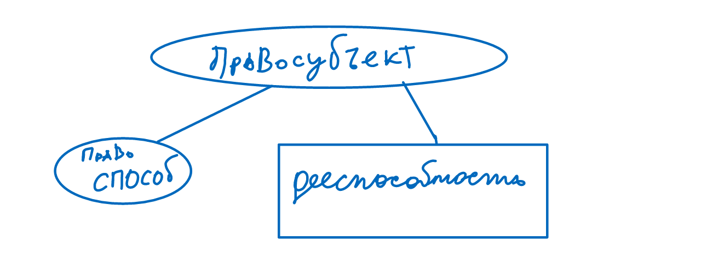

Правоведение. Лекция 5
===========

<b>Основы правового статуса личности. </b>
 
Субъекты права :
<ul><li>Гражданин (физическое лицо) </li><li>Коммерческое (юридическое лицо) </li><li>Некоммерческое (юридическое лицо) </li></ul>
 Человек &lt;-&gt;Сущность  (ст. 17-18 ГК РФ)  

Содержание основ правового статуса человека и гражданина образуют из:
<ul><li>Конституционное право субъекта <ul><li>Правоспособность- право нести ответственность и обязанности. Начинается с рождения,  прекращается со смертью. </li><li>Дееспособность -  способность лица,  своими действиями приобретать и реализовать свои конституционные права,  тем самым он создаёт для себя конституционные обязанности и берёт ответственность за их исполнение. В полном объёме возникает с наступлением совершенолетия </li></ul></li><li>Принципы правового статуса человека и гражданина. (Декларация прав свобод человека и гражданина принятая ген. ассамблеей  ООН от 1948 года) </li><li>Конституционные права,  свободы и обязанности человека и гражданина. Конституция России. </li><li>Конституционная гарантия реализации прав и свобод. </li></ul>
 Приобретение гражданства России:
<ol><li>По рождению (по месту рождения, по крови) </li><li>В результате приёма гражданства России </li><li>В результате восстановления гражданства России</li><li>Путём выбора гражданства (обтация) </li><li>При изменении государственной принадлежности территории </li></ol>
Иные основания 
<ul><li>Опекунство,  усыновление. </li><li>Институт почётного гражданства </li></ul>
 Гражданство теряется :
<ol><li>Отказ от гражданства </li><li>Иные основания,  прописанные в ФЗ </li></ol>
 Выход из гражданства невозможен,  
<ul><li>если имеются не выполненные перед Россией обязательства,  предусмотренные законом. </li><li>Когда лицо привлечено в качестве обвиняемого или обвинительное решение суда в отношении лица. </li></ul>
 Независимо от способа приобретения гражданства все имеют равные права и свободы. Конституция закрепляет конституционные права и свободы. Тем самым они обладают наивысшей юридической силой и имеют государственно  правовое охрану. 
 
Конституционные права и свободы носят всеобщий характер. Обладание ими не связано наличии у лица какого-либо статуса 

